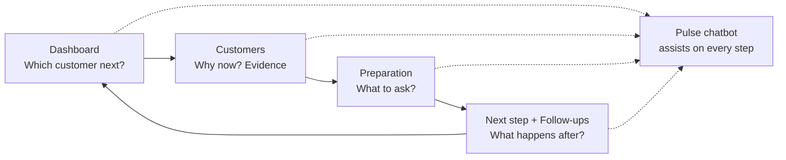
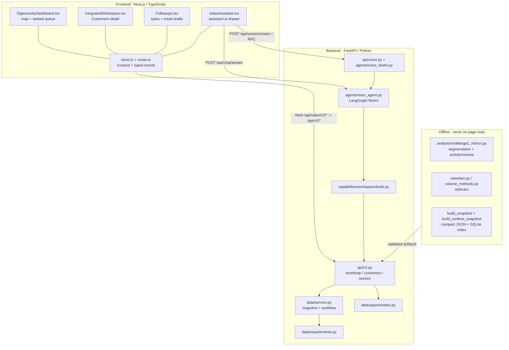
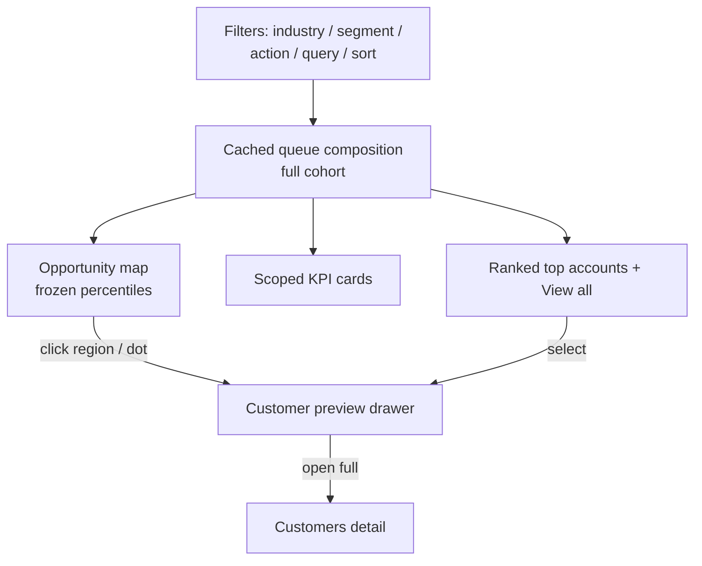
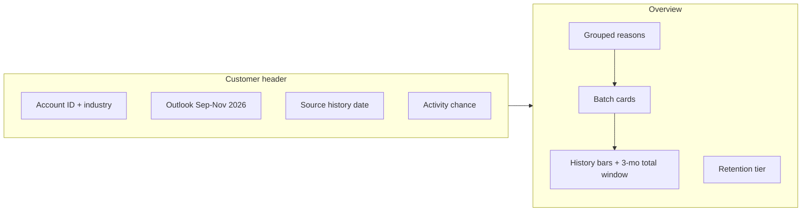
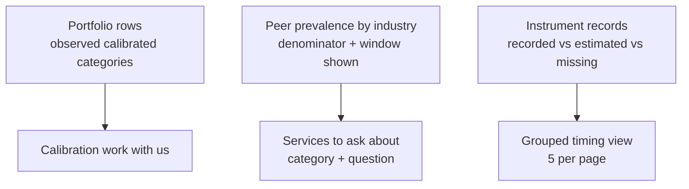
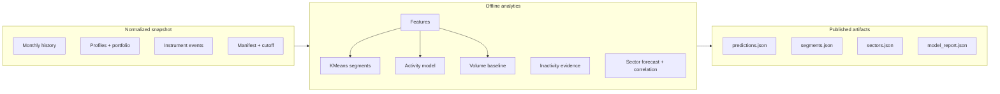
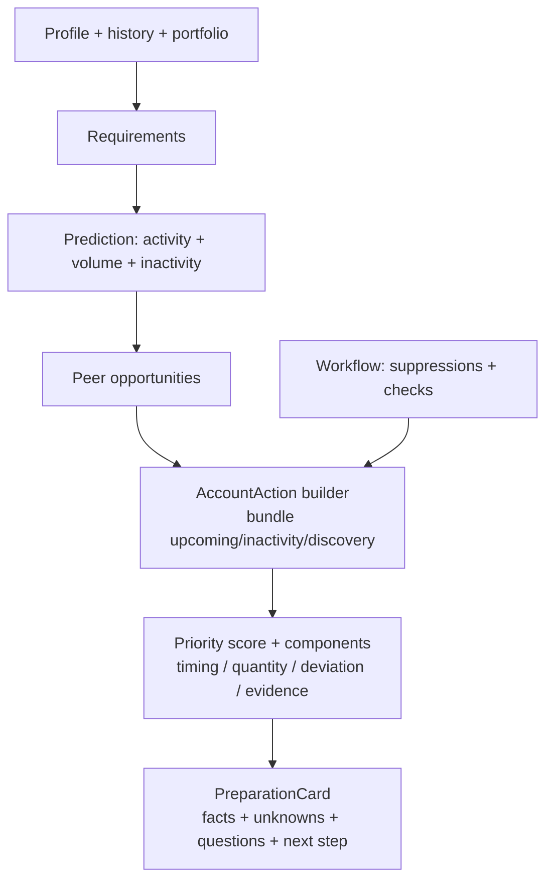
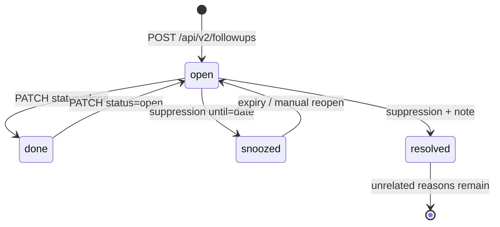
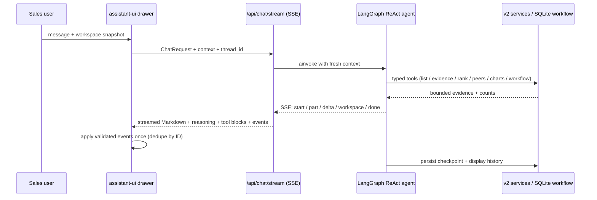
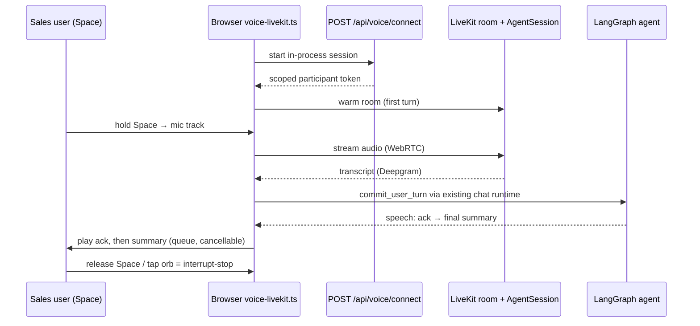

# Challenge 2 — PeCal Pulse: Implemented Features

> Inside Sales assistant for Perschmann Calibration.
> Answers: **Which customer should I contact next, why now, what should I ask, and what happens afterwards?**
>
> Source snapshot (local historical prototype, not live operations):
> `historical-full-20260831-v2`, reference **2026-08-31**, forecast window **Sep–Nov 2026**,
> 6,564 accounts, 3,180 model-supported forecasts. Fresh clone defaults to `synthetic-v1` fixture.
> See `AGENTS.md`, `context.md`, `plan.md`, `integration-audit.md`, `backend/app/agents/README.md`.

## 1. End-to-end user journey

How the four sales steps map to implemented UI modules:



1. **Review** a manageable ranked queue on Dashboard.
2. **Open** an account and inspect history, due requirements, predictions, flag evidence.
3. **Ask** Pulse to explain it, filter customers, or create a chart.
4. **Prepare** a conversation, record correction/outcome, save next follow-up.
5. **See** that follow-up and corrected recommendation after reload.

## 2. System architecture

What talks to what. Frontend never computes business scores; backend never executes arbitrary UI code.



Contracts: `frontend/src/types/sales-v2.ts` mirrors backend Pydantic models.
Frontend rewrite `/api/sales/*` → Python `/api/*`. No second chart library (ECharts only),
no generated JavaScript execution, no general SQL tool.

## 3. Dashboard — choose the next customer

Ranked proactive queue + two-axis opportunity map.

- Larger two-axis map, 4 clickable shaded model regions, bounded customer dots.
- Coordinates use frozen mid-rank cohort percentiles, displayed `-100` to `+100`, zero at median.
  Identical evidence keeps identical position. Market filters do not refit the model.
- Default model gates: silhouette `0.450`, seed ARI `0.999`, outlier ARI `0.972`; 2,670 scored accounts.
  Discovery-only accounts without timing evidence stay listed with no invented urgency.
- Scoped metrics + ranked accounts; group selection and filters update cards/table from same full cohort.
- One global top-bar assistant entry (replaces repeated Ask Pulse buttons).
- Agent action feedback pulses affected filter/control surfaces + 3.5s status pill; respects reduced-motion.
- Priority breakdown popover: per-point components + response-level ranking weights. Priority points, never euros.
- Dashboard preparation is scoped to its due-window / inferred-date / past-due settings.



Key files: `frontend/src/modules/sales/OpportunityDashboard.tsx`, `opportunity-regions.ts`, `store.ts`.

## 4. Customers workspace — understand why now

Filters/list + independently selected account. Tabs: **Overview, Equipment, Next step**.
Desktop uses viewport height with independently scrollable account/detail panels; small screens use natural page scroll.

### 4.1 Overview tab

- Grouped reasons: `upcoming` / `inactivity` / `discovery`. Each keeps its original reason ID for workflow updates.
- Compact calibration batch cards: quantity, equipment category, readable timing,
  recorded vs estimated date source, previous work in that category.
- Previous category work is not restricted to displayed batch.
- Batch snooze/resolve controls appear only for calibration batches.
- Inactivity/discovery are conversation reasons, not generic batch cards.
- Activity chart: historical calibration bars (24 or 3 months selectable) followed by shaded 3-month forecast window
  labelled `3-month total ≈ N calibrations`. No future monthly bars/line, no fabricated interval.
- Info icon reports forecast input window + quantity-model holdout WAPE/sample size.
- Customer header shows account ID/industry + outlook range + source-history date + activity chance together.
- Retention signal: forward 3-month return rates by silence month, tiered `lower/moderate/higher`, with basis-episode counts.



### 4.2 Equipment tab

- `Calibration work with us`: category + completed calibrations. No unavailable inventory-count column.
- `Services to ask about`: named category + actual conversation question + peer-supported context.
- `InstrumentTiming.tsx`: full-account recorded/estimated/missing timing counts + expandable paginated groups
  (5 groups per page, 5 categories per page). Grouped by equipment, basis, date range, eligibility; instrument IDs deduped.
  Sample quantities are never presented as full-account totals.
- Instrument-date records collapsed. Instrument IDs are lookup references, not priority scores.
- Current exports have categories/IDs/dates/interval/stop flags; no product names/brands/models in export
  (do not infer absence in underlying SQL schema).



### 4.3 Data meanings preserved in UI

- Activity probability = **at least one observed calibration at Perschmann in next 3 full months**.
  Not order/conversion/churn, not outreach benefit.
- Calibration events, distinct instruments, requirements, service records, order positions are different units.
- `Recorded due date` = real source date. `Estimated due window` = supported inference.
  Passed date does not prove outstanding work. Stop flags respected.
- Industry peers support a discovery question, not proof of ownership or competitor business.
- `Longer gap than usual` warrants investigation, not confirmed loss.

## 5. Predictions, ranking, and sectors — how the queue is built

### 5.1 Offline training (never in API requests)

- Analytics v3: annual/seasonal features, chronological validation, single-thread offline training.
- Activity: logistic regression selected, holdout ROC AUC `0.810`, Brier `0.176`.
- Volume: previous-12-months divided by 4 still wins (test WAPE `65.05%`, MAE ~`11.52` calibrations
  over 18,363 customer-origin windows / 3,515 test accounts). Quantities are directional.
- WAPE = aggregate absolute error / aggregate actual volume. Not individual accuracy.
- Unsupported accounts return `null` + reason, never mock numbers in historical mode.
- Sidecars in ignored `data/runtime/analytics-v3/<snapshot>/` with graceful fallback:
  `retention.json`, `volume_reliability.json`, expected-value ranking weights.
- Compact runtime JSON ~63 MB vs ~652 MB raw; indexed SQLite retains full requirement evidence.
  API rejects raw snapshots >100 MB. Plot sample defaults 200, capped 1,000.
  Account detail loads at most 500 evidence records.



### 5.2 Transparent opportunity ranking

Peer discovery uses account-level ownership of observed calibrated category, target excluded.
Defaults: min 20 eligible peer accounts, 25% prevalence. `Unknown`/`Sonstiges` excluded from specific claims.

Expected-value ranking `rank-v2` (weights 30/25/15/15/15):
`P(activity) × expected volume × relative unit value`, normalized by snapshot max anchor.
Rank stability: mean Spearman `0.988`, min `0.955`, top-decile overlap `0.966`.



Due-window outreach reasons restricted to supported windows within 90 days either side of reference.
Past-due requires review. Agreed due follow-ups form separate deadline-first section.

## 6. Next step + Follow-ups — record what happens after

Sales workflow, persisted in local SQLite separately from SQL history. No CRM/SQL writes.

Flow: **confirm calibration need → check in after longer gap → ask about specific additional services → check team activity → save next step.**
Raw preparation paragraphs replaced by short facts/questions. Exported briefs use same sales language.

- Account owner, structured outcome, next step/date.
- Manual checks: quotation/order, recent contact, contact details — always labelled manually supplied.
- Reason-scoped snooze (requires end date) / resolution (requires note). Invalid reasons rejected before writes.
- Completing a follow-up does not auto-resolve calibration need. Retirement needs explicit instrument scope.
- Follow-ups view: persisted tasks, completion/reopening, collapsible EN/DE email drafts + Copy action.
  Drafts carry source dates, linked reasons, review notes; no recipient invented, no email sent.
  Identical requests reuse existing task. Owner defaults to saved account owner or Unassigned.
- Team assignment: up to 20 explicit IDs, all validated before atomic local write.
- Legacy synthetic tasks stored but hidden from historical customer views.



Endpoints preserve v1 compatibility; v2 adds `reason_ids`, workflow patch returning
`customer.workflow.updated` with refreshed `{workflow, action}`.

## 7. Pulse chatbot — grounded sales assistant

assistant-ui drawer, streamed Markdown, provider-returned reasoning in collapsible Thinking block,
tool-call displays, cancellation, expandable drawer, SQLite checkpointing.

- Model from root `.env` `LLM_MODEL`; reasoning effort from `RESONING_LVL` (spelling intentional), default `low`.
  Restart API after changes. Credentials never reach browser.
- Fresh `WorkspaceContext` every turn: page/tab, selected account, visible IDs/metrics,
  filter values/options, sorting/pagination, plot settings, source dates, artifacts, available controls.
  Current context overrides checkpointed selection. Changed filters invalidate old metrics.
- Typed tools wrap same v2 services as UI: list/filter accounts (`1–50`, default `10`),
  read evidence/prediction/ranked actions/peers/preparation, navigate/select/filter,
  set tabs/list size/shortlist/plot sampling/preview, assignment, next-step/task ops,
  user-reported checks, exact reason snooze/resolve, `draft_followup_emails`,
  service-backed bar/line charts.
- One active run per thread, max 12 tools, 30 graph steps, 90s turn timeout.
- Artifacts are chat-only, persisted with assistant message/history. Multiple `create_chart` calls = multiple inline charts.
  Dashboard/Insights no longer append them.
- Replies propose UI events via event router; cannot confirm browser applied them (receipts deferred).
- History: `GET /api/chat/threads/{UUID}/messages`. Frontend stores only UUID.
  Restoring never replays workspace commands. New conversation starts new thread.
- No direct SQL, no arbitrary browser JS, no live outreach, no CRM writes. Daytona sandbox is optional enhancement, not implemented as arbitrary-code tool.
- System prompt uses nontechnical sales language; must cite explicit account evidence before inactivity/discovery claims.



SSE events: `start, part, delta, workspace, done, error`.
Failures share safe classification (SDK/stream/timeout/rate/credit/access/recursion); logs contain category/class only.
Failed tools marked failed in chat; no auto-retry of writes. Cancellation stops tokens, releases thread; already-applied reversible UI events are not rolled back.

## 8. Voice — LiveKit push-to-talk

Streaming voice, no Gradium fallback, no separate voice LLM.

Setup: `LIVEKIT_URL`, `LIVEKIT_API_KEY`, `LIVEKIT_API_SECRET` in ignored root `.env`; restart API.
LiveKit Cloud inference: Deepgram Nova-3 multilingual transcription + Inworld TTS 2 Flash (Ashley).
Browser gets only short-lived room-scoped participant token. Audio over WebRTC, not saved; transcripts reuse chat history.

- Open assistant, hold Space to speak, release to send; orb tap also works.
- First connection warms room; subsequent turns reuse it.
- One immediate acknowledgement while LangGraph works, then final opening summary (≤600 chars).
  Tool narration/reasoning/charts stay in assistant-ui.
- Space interrupts speech/current turn; active orb tap stops; speaker button tests output or replays latest summary.
- Close/new conversation disconnects audio, releases room. Mic stops on release, recordings capped 44s.
- `responseTimeout` is milliseconds (client floor 8000): `voice-livekit.ts` sends 15000, `end_turn` 30000.
  Seconds-scale value times out every call after ~15 ms.



Verified: 204 backend tests (12 voice adapter/turn), 4 Node transport regressions + RPC timeout-floor test,
frontend typecheck/build pass; live cloud WebRTC synthetic transport test delivered first audio ~0.28s
and transcribed generated phrase; browser/user acceptance of new LiveKit path still pending where noted in `AGENTS.md`.

## 9. What is explicitly not claimed / not implemented

- No confirmed churn, revenue/margin, incremental outreach benefit, exact next-order dates,
  ownership of unobserved equipment, live quotation availability.
- No monthly customer forecasts, prediction intervals, causal uplift, multivariate sector forecast,
  commercial value inputs, full sandbox execution, browser application acknowledgements,
  CRM/live quote/contact integration, or voice on every path.
- Financial scenarios remain optional backend capability, removed from main sales UI.
- Historical extracts do not establish today's live quotations/orders, contact people,
  recent sales conversations, revenue or margins.

## 10. Run, verify, refresh

```bash
uv sync
pnpm --dir frontend install
bash scripts/dev.sh
# frontend http://127.0.0.1:3000, API http://127.0.0.1:8001/docs
```

```bash
uv run python -m unittest discover -s backend/tests -q
pnpm --dir frontend typecheck
pnpm --dir frontend build
```

Historical snapshot selection: `PECAL_SNAPSHOT=historical-full-20260831-v2` in root `.env`, restart backend.
For a new authorized extract, build immutable snapshot + train offline, then publish runtime snapshot
(see `README.md` commands). Training never runs in API requests. Keep older artifact directories for rollback.
