# Challenge 2 — How PeCal Pulse Works (Simple Guide)

> For Inside Sales. Answers: **Which customer next, why now, what to ask, what next?**
> In short words. With pictures of how the code works.

## 1. Big picture

You do 4 steps. The app helps at each step. The chatbot helps everywhere.

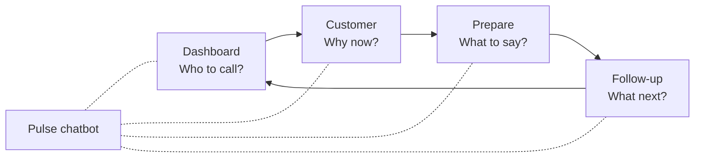

In plain words:
* **Frontend** shows buttons, lists, charts. Built with Next.js.
* **Backend** gives answers. Built with FastAPI Python.
* **Offline job** learns from history. It runs once, not when you click.
* Frontend never guesses scores. Backend never clicks buttons for you.

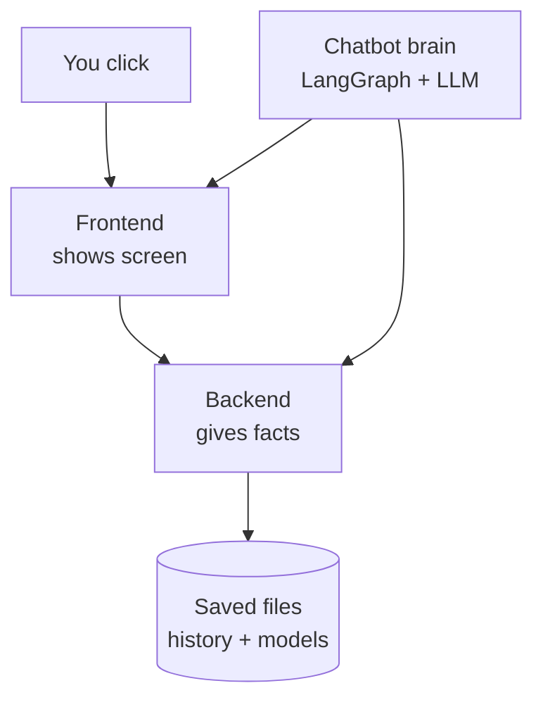

## 2. Dashboard — Who to call next?

What you see: a map with dots. Each dot is a customer. Top list shows best 10.

How it works:
* Backend already scored all customers offline.
* Frontend only shows the score. It does not calculate it.
* Map position is fixed. Same facts = same place.
* Filters only hide or show dots. They do not re-learn the model.

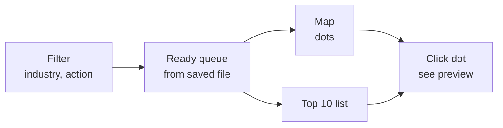

Software part: `OpportunityDashboard.tsx` + `store.ts` for state. ECharts draws the map.

## 3. Customer page — Why now?

What you see: 3 tabs — Overview, Equipment, Next step.

Overview shows:
* Reasons grouped: due soon, quiet for long, new idea.
* Small cards: how many tools, which type, when due.
* Bar chart: past work + shaded next 3 months total.
* Risk note: how often quiet customers come back.

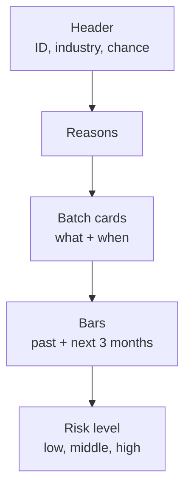

Equipment shows:
* What we already calibrated for them.
* What peers have but they don't — as a question, not a claim.
* Dates grouped, 5 per page, so it stays readable.

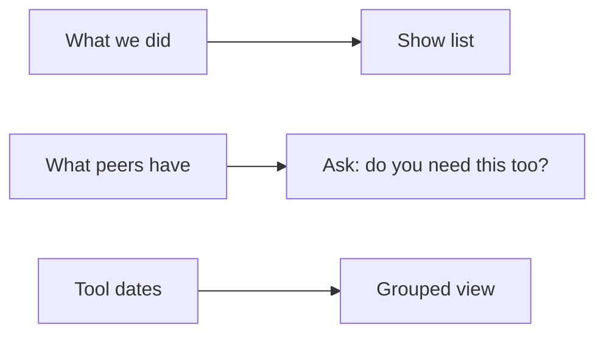

Software part: `IntegratedWorkspace.tsx`, `CustomerSignals.tsx`, `InstrumentTiming.tsx`.

## 4. Machine learning — How predictions are made

Simple idea: learn from past, guess next 3 months. Training happens offline, once.

* **Activity guess:** Will we see at least 1 calibration in Sep-Nov 2026? Uses logistic regression. It finds patterns in recency, frequency, gaps. Score 0.81 means it separates well.
* **Volume guess:** How many calibrations? Simple average wins: last 12 months divided by 4. Error is high, so we only show total, not per month.
* **Groups:** KMeans puts similar customers in 3 groups.
* **Quiet check:** If quiet much longer than usual rhythm, flag for review. Not churn, just “look here”.

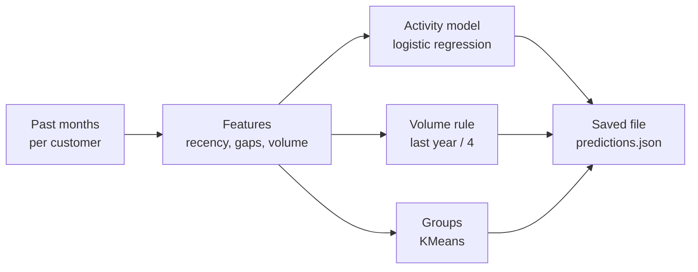

ML part: `analysis/challenge2_ml/run.py`, `backend/app/capabilities/analytics/`. API only reads the saved file. No training on click.

## 5. Ranking — How the order is decided

Simple idea: best = likely + big + soon + strong proof.

Score = timing x quantity x activity x proof. Weights 30/25/15/15/15. Shown as points, not euros.

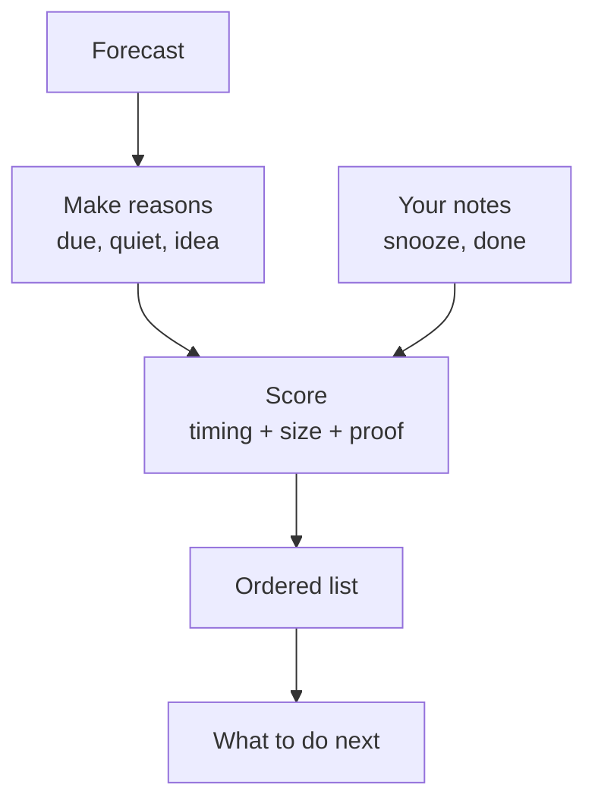

Peer idea example: 30 of 100 car workshops calibrate pressure gauges, you don’t. So we ask: “Do you need pressure too?” We don’t claim you own one.

Software part: `insights/peers.py`, `actions.py`, `preparation.py`, `value_weights.py`.

## 6. Next step + Follow-ups — What happens after?

What you see: owner box, checks, snooze / done buttons, task list, email draft.

How it works:
* All notes save in local SQLite file, not in SAP / SQL Server.
* Snooze needs a date. Done needs a note. Wrong ID is blocked.
* After you save, only that customer refreshes.
* Email button only writes a draft in English or German. It never sends mail.

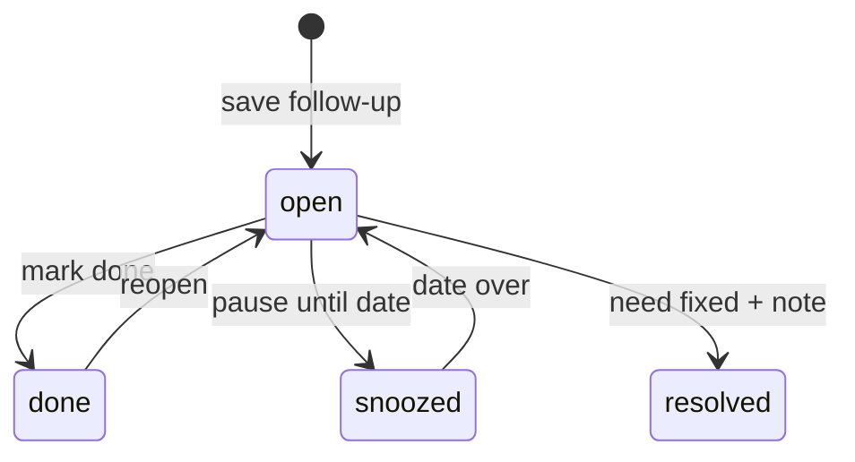

Software part: `data/workflow.py`, `api/v2.py`, `Followups.tsx`. Events: `followup.created`, `customer.workflow.updated`.

## 7. Pulse chatbot — AI helper

What you see: chat drawer on the right. It writes, thinks, shows tools, makes charts.

How it works:
* Brain is LangGraph ReAct agent. LLM is set by `LLM_MODEL` in `.env`.
* Each message sends fresh screen snapshot: page, filters, selected customer.
* Agent can only use allowed tools: search, read facts, filter, select, chart. No free SQL, no free code.
* Charts live only in chat, not on Dashboard.
* Chat history is saved by thread ID in SQLite. Reload brings it back. New chat starts new ID.

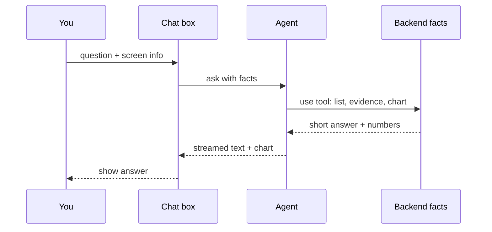

AI part: `agents/react_agent.py`, `capabilities/workspace/tools.py`, `contracts.py`. Limits: 1 run per chat, max 12 tools, 90 sec timeout. Errors show safely, no retry of saves.

## 8. Voice — Talk instead of type

What you do: hold Space, speak, let go. Pulse answers by voice + text.

How it works:
* Browser sends voice via LiveKit room. Gets only a short token, not the secret key.
* Cloud writes text from speech, then speaks answer back. Details and charts stay on screen.
* First click warms up the room. Next turns are faster.

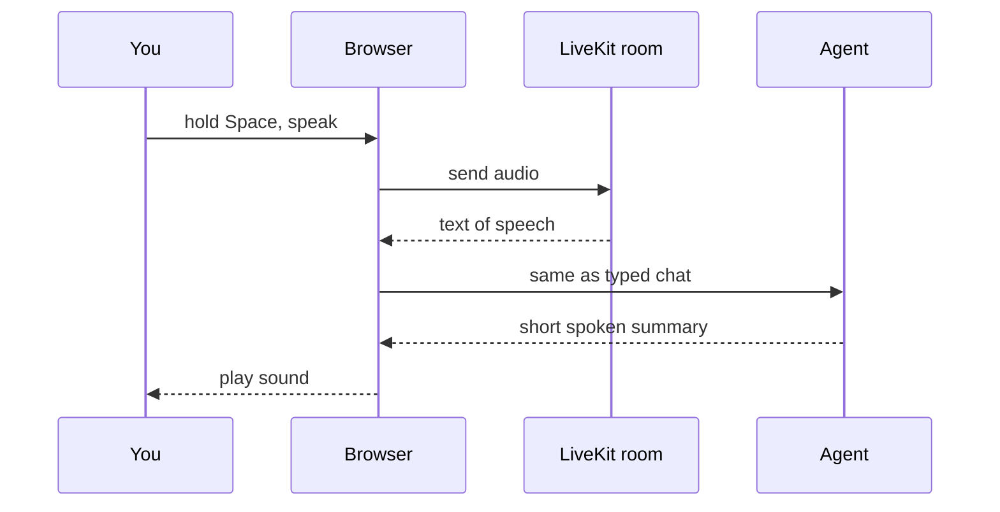

Tech part: `api/voice.py`, `agents/voice_livekit.py`, `voice-livekit.ts`. Audio is not saved. Transcripts reuse chat history. Mic stops on release, max 44 sec.

## 9. Data plumbing — Where files live

* Raw extract: ignored `analysis/customers/` — private, not in Git.
* Compact file ~63 MB + SQLite index — fast for API. Raw was ~652 MB, too big.
* Models: ignored `data/runtime/analytics-v3/` — `predictions.json`, `segments.json`, `sectors.json`, `model_report.json`, `retention.json`.
* Workflow + chat: ignored `data/runtime/` SQLite — your notes, not source truth.
* Fresh clone uses `synthetic-v1` demo data until you set `PECAL_SNAPSHOT`.

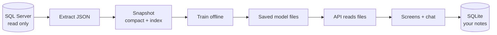

Rule: train offline, serve fast. API rejects files over 100 MB. Plot shows 200 points max, totals still full.

## 10. What it does NOT do

* No churn promise. Only “quiet, check it”.
* No revenue, margin, or profit cards in UI.
* No monthly forecast per customer. Only 3-month total.
* No auto mail sending, no CRM write, no SQL write.
* No live orders, quotes, or contacts. Manual checks are labelled manual.
